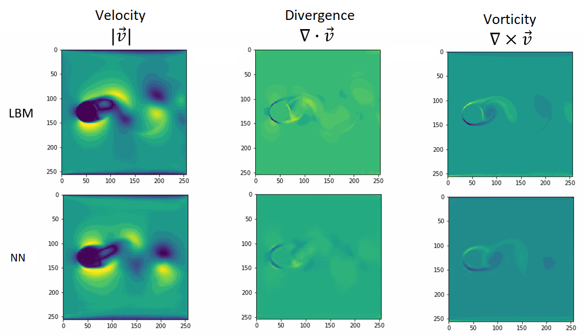

# Deep Learning Model for Computational Fluid Dynamics

[(Colab Demo)](https://colab.research.google.com/github/leoffx/deep-learning-model-for-computational-fluid-dynamics/blob/master/dl_model_for_cfd.ipynb)

## Prerequisites

### Setup TensorFlow

This code was created and tested using TensorFlow 2.0 GPU on Google Colab. The installation can be done by running the command `!pip install tensorflow-gpu==2.0.0` before the imports. Newer versions should work as well.

### Generate Dataset

The dataset can be generated using the first session in `dl_model_for_cfd.ipynb` notebook. In this example we generate a simple 2D dataset with 128x128 simulation resolution.

By completely running the notebook it will be generated four files, two that stores the simulations' Lattice Boltzmann distributions train and test, and two that stores the objects placement info, also for train and test. The training files will have 40 simulations in it, with 100 frames each, and the test will have 3 simulations, with also 100 frames each.

Others parameters like the simulation resolution and the number of examples created can be changed easily too, by adjusting, respectively, `simulation_res ` and `examples_number`. Depending on the avaiable RAM, the simulations will have to be split on multiple files.

### Train the model

The model can be trained by running the second session in `dl_model_for_cfd.ipynb` using the `utils.py` file as a helper functions library.

### Results comparison

